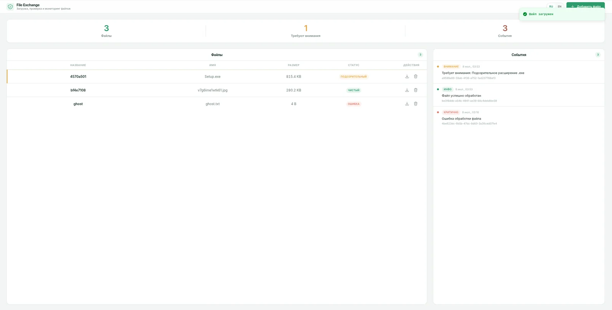

<div align="center">

<div align="center">
  
  <h1><b>File Exchange</b></h1>
  <p>
    <strong>Загрузка, сканирование и мониторинг файлов</strong><br>
  </p>
  <p>
    <a href="CHANGELOG.md"></a>
    <a href="https://www.python.org/"></a>
    <a href="https://fastapi.tiangolo.com/"></a>
    <a href="https://vuejs.org/"></a>
  </p>
</div>

<p>
  <a href="#быстрый-старт">Быстрый старт</a>
  ·
  <a href="#архитектура">Архитектура</a>
  ·
  <a href="#api">API</a>
  ·
  <a href="docs/DEVELOPERS.md">Developers</a>
  ·
  <a href="CHANGELOG.md">История изменений</a>
  ·
  <a href=".github/workflows/ci.yml">CI</a>
</p>

</div>

---

<table>
  <tr>
    <td><strong>Назначение</strong></td>
    <td>Сервис обмена файлами для собственного развёртывания: загрузка, фоновое сканирование, оповещения и панель мониторинга.</td>
  </tr>
  <tr>
    <td><strong>Демо</strong></td>
    <td><a href="https://kudyasoft-file-exchange.hf.space/">
    
  </a></td>
  </tr>
  <tr>
    <td><strong>Формат</strong></td>
    <td>Модульный асинхронный монолит: FastAPI + Vue SPA, один <code>docker-compose.yml</code> с профилями <code>dev</code> / <code>prod</code>.</td>
  </tr>
  <tr>
    <td><strong>Акцент</strong></td>
    <td>Фоновая обработка через Taskiq, правила сканирования, метаданные PDF, наблюдаемость через оповещения и структурированные логи.</td>
  </tr>
</table>


---

<p align="center">
  
</p>
<p align="center"><sub>Дашборд: загрузка файлов, статусы сканирования, лента событий (RU / EN).</sub></p>

## Оглавление

<table>
  <tr>
    <td width="33%">
      <strong>Старт</strong><br>
      <a href="#быстрый-старт">Быстрый старт</a><br>
      <a href="#запуск">Запуск</a><br>
      <a href="#переменные-окружения">Переменные окружения</a><br>
      <a href="#качество-кода">Качество кода</a>
    </td>
    <td width="33%">
      <strong>Система</strong><br>
      <a href="#стек">Стек</a><br>
      <a href="#архитектура">Архитектура</a><br>
      <a href="#api">API</a><br>
      <a href="#возможности">Возможности</a>
    </td>
    <td width="33%">
      <strong>Эксплуатация</strong><br>
      <a href="#данные-и-хранилище">Данные и хранилище</a><br>
      <a href="#тесты">Тесты</a><br>
      <a href="#деплой">Деплой</a><br>
      <a href="#решение-проблем">Решение проблем</a><br>
      <a href="docs/DEVELOPERS.md">Developers</a>
    </td>
  </tr>
</table>

---

## Быстрый старт

```bash
mise install
cp .env.dev .env
mise run dev     # Docker: Vite :3000 + backend :8000
mise run test    # pre-commit + mypy + pytest + vitest + сборка
```

<table>
  <tr>
    <td><strong>Интерфейс (dev)</strong></td>
    <td><a href="http://localhost:3000">http://localhost:3000</a></td>
  </tr>
  <tr>
    <td><strong>Документация API (dev)</strong></td>
    <td><a href="http://localhost:8000/docs">http://localhost:8000/docs</a></td>
  </tr>
  <tr>
    <td><strong>Проверка живости</strong></td>
    <td><a href="http://localhost:8000/health">http://localhost:8000/health</a></td>
  </tr>
  <tr>
    <td><strong>Готовность</strong></td>
    <td><a href="http://localhost:8000/ready">http://localhost:8000/ready</a></td>
  </tr>
  <tr>
    <td><strong>Продакшен (nginx)</strong></td>
    <td><a href="http://localhost">http://localhost</a> — интерфейс и API на <code>/api/v1/…</code></td>
  </tr>
</table>

## Запуск

**Нужно:** Docker Compose, [mise](https://mise.jdx.dev/getting-started.html). Для локальных инструментов без полного стека — Python 3.12 + [uv](https://docs.astral.sh/uv/), Node 22+.

### Docker

```bash
cp .env.dev .env
mise run dev    # разработка: Vite с автоперезагрузкой, uvicorn --reload
mise run up     # prod-подобный режим: nginx, собранный SPA, JSON-логи, без /docs
mise run down   # остановить все профили
```

Сервисы в Compose:

| Сервис | Профиль | Назначение |
| ------ | ------- | ---------- |
| `backend` | всегда | FastAPI, порт 8000 |
| `taskiq` | всегда | фоновый обработчик |
| `frontend-dev` | dev | Vite, порт 3000 |
| `frontend` | prod | собранный SPA (nginx) |
| `nginx` | prod | обратный прокси, порт 80 |
| `postgres`, `redis` | всегда | БД и брокер очереди |

### Миграции

```bash
mise run migrate
```

Или внутри запущенного стека:

```bash
docker compose --profile prod run --rm backend uv run alembic upgrade head
```

### Локальная установка зависимостей

```bash
uv sync --directory backend --all-groups
npm --prefix frontend ci
```

### Переменные окружения

Шаблон — [`.env.dev`](.env.dev). Скопируйте в `.env` перед запуском.

| Переменная | Зачем |
| ---------- | ----- |
| `DATABASE_URL` | PostgreSQL (asyncpg); backend и taskiq |
| `REDIS_URL` | брокер Taskiq |
| `STORAGE_PATH` | каталог загруженных файлов (общий том) |
| `MAX_UPLOAD_MB` | лимит размера загрузки (по умолчанию 50) |
| `SCAN_MAX_MB` | порог «подозрительно большой» файл (по умолчанию 10) |
| `LOG_FORMAT` | `console` в dev, `json` в prod |
| `DOCS_ENABLED` | OpenAPI `/docs`; `false` в prod |
| `UVICORN_RELOAD` | `--reload` в dev, пусто в prod |

### Качество кода

```bash
mise run lint          # pre-commit: ruff, mypy, unit-тесты, vue-tsc, vitest
mise run test          # полный прогон в Docker + сборка frontend
```

`mise run dev` устанавливает pre-commit hooks автоматически.

CI прогоняет ruff, mypy, pytest (≥85% покрытия), vue-tsc, Vitest и production-сборку. Конфиг: [`.github/workflows/ci.yml`](.github/workflows/ci.yml).

---

## Стек

<table>
  <tr>
    <td><strong>Backend</strong></td>
    <td>FastAPI, SQLAlchemy 2 async, asyncpg, Alembic, Taskiq, Redis, structlog, filetype, pypdf</td>
  </tr>
  <tr>
    <td><strong>Frontend</strong></td>
    <td>Vue 3.5, TypeScript, Vite 6, Tailwind 3, TanStack Query, vue-i18n, vue-sonner</td>
  </tr>
  <tr>
    <td><strong>Инфраструктура</strong></td>
    <td>Docker Compose, nginx (prod), PostgreSQL 16, Redis 7</td>
  </tr>
  <tr>
    <td><strong>Качество</strong></td>
    <td>uv, ruff, mypy, pytest, Vitest, pre-commit, mise</td>
  </tr>
</table>

<table>
  <tr>
    <td><strong>Почему FastAPI</strong><br>Быстрый async API. OpenAPI из коробки.</td>
    <td><strong>Почему Taskiq</strong><br>Фоновый воркер. Без Celery.</td>
    <td><strong>Почему Vue</strong><br>Интерфейс из коробки. Vite + Query.</td>
  </tr>
</table>

---

## Возможности

Сервис принимает файл, проверяет его в фоне и показывает результат в панели — без ручного опроса статуса.

| Область | Что умеет |
| ------- | --------- |
| **Загрузка** | Перетаскивание, необязательный заголовок, лимит размера. |
| **Сканирование** | Расширение, размер, MIME и сигнатура — в фоне, без блокировки. |
| **Метаданные** | Страницы PDF, строки и символы у текста. |
| **Оповещения** | «Всё ок» или «посмотреть» — лента обновляется сама. |
| **Файлы** | Список, статусы, скачивание, удаление с оповещениями. |
| **Локализация** | RU / EN — интерфейс, ошибки и детали сканирования. |
| **Эксплуатация** | `/health`, `/ready`, ID запроса в логах, JSON в prod. |

---

## Архитектура

Модульный async-монолит: **backend** (HTTP + enqueue), **taskiq** (scan + metadata + alerts), **frontend** (SPA). PostgreSQL — источник истины; Redis — только очередь; файлы — на томе `file_storage`.

| Слой | Где |
| ---- | --- |
| HTTP | `api/v1/files`, `api/v1/alerts`, middleware |
| Сервисы | `services/files`, `processing`, `alerts` |
| Домен | `processing/rules`, `processing/metadata` |
| Фон | `worker/tasks` → `process_file` |

Подробнее: диаграммы, middleware, session scope, идемпотентность pipeline, ER-модель — в [docs/DEVELOPERS.md](docs/DEVELOPERS.md) (§3–§8).

---

## API

REST под `/api/v1/`. Dev — через прокси Vite или `:8000`; prod — через nginx. Полная спецификация, модели и curl — [docs/DEVELOPERS.md §10](docs/DEVELOPERS.md#10-http-api).

| Метод | Путь | Назначение |
| ----- | ---- | ---------- |
| `GET` | `/health` | живость процесса |
| `GET` | `/ready` | готовность (PostgreSQL) |
| `GET` | `/api/v1/files` | список файлов |
| `GET` | `/api/v1/files/{id}` | один файл |
| `POST` | `/api/v1/files` | загрузка (`file`, необязательный `title`) |
| `DELETE` | `/api/v1/files/{id}` | удаление |
| `GET` | `/api/v1/files/{id}/download` | скачивание |
| `GET` | `/api/v1/alerts` | оповещения |

OpenAPI: [`/docs`](http://localhost:8000/docs) (если `DOCS_ENABLED=true`).

```bash
curl -X POST http://localhost:8000/api/v1/files \
  -F "file=@report.pdf" -F "title=Отчёт Q3"
```

---

## Данные и хранилище

| Путь | Что хранится |
| ---- | ------------ |
| `pg_data` (том) | метаданные файлов, оповещения |
| `file_storage` (том) | бинарные файлы на диске |
| Redis | очередь Taskiq (не основной источник данных) |

---

## Тесты

```bash
mise run test
```

| Слой | Инструмент | Покрытие |
| ---- | ---------- | -------- |
| Backend | pytest, ruff, mypy | ≥85% (`src/`), unit + integration |
| Frontend | vue-tsc, Vitest | ≥85% (api, composables, utils, i18n) |

Отдельно:

```bash
uv run --directory backend pytest tests/unit -q
uv run --directory backend pytest tests/integration -q   # нужен Docker-стек
npm --prefix frontend run test
npm --prefix frontend run typecheck
```

---

## Деплой

```bash
cp .env.dev .env
# в .env для prod:
# LOG_FORMAT=json
# DOCS_ENABLED=false
# UVICORN_RELOAD=

mise run up
mise run migrate
```

Приложение: [http://localhost](http://localhost). Проверка живости: [http://localhost/health](http://localhost/health).

---

## Решение проблем

Краткая таблица — ниже. Подробнее: [docs/DEVELOPERS.md §15](docs/DEVELOPERS.md#15-решение-проблем).

| Симптом | Причина | Что сделать |
| ------- | ------- | ----------- |
| Файл долго в `processing` / статус не меняется | Воркер не обрабатывает очередь | `docker compose ps` — `taskiq`, `redis`, `postgres` должны быть `healthy`. Логи: `docker compose logs taskiq -f` |
| То же | Задача упала в воркере | В логах taskiq — traceback; после исправления перезапустите: `docker compose restart taskiq` |
| Загрузка → **413** | Файл больше лимита | Сверьте `MAX_UPLOAD_MB` в `.env` и `client_max_body_size` в `infra/nginx/nginx.conf` (оба 50m). Уменьшите файл или поднимите лимиты в обоих местах |
| UI открывается, API — **500** / таблицы пустые | Не применены миграции | После `mise run up`: `mise run migrate`. Проверка: `curl http://localhost/ready` → `"database": "ok"` |
| API → **404** | Неверный путь | Бизнес-эндпоинты только под `/api/v1/…`, не `/files` |
| `mise run up` не стартует nginx | Порт **80** занят | Остановите другой сервис на 80 или смените проброс в `docker-compose.yml`, например `"8080:80"` |
| Команды / Docker ведут себя странно (Windows) | Shell или пути не из Linux-окружения | Docker Desktop с WSL2; команды из терминала WSL, не из cmd |

---

<div align="center">

<sub>File Exchange · v1.0.0 · FastAPI · Vue · Taskiq</sub>

</div>
