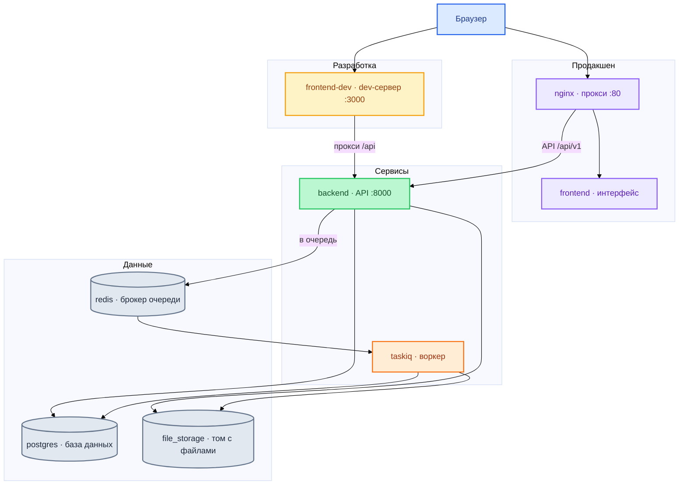
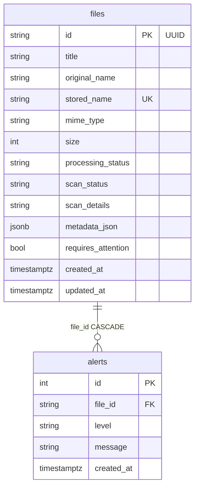
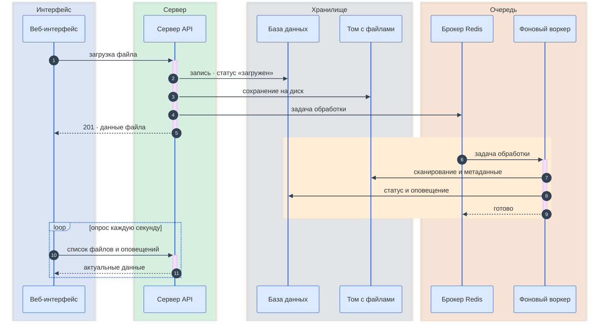
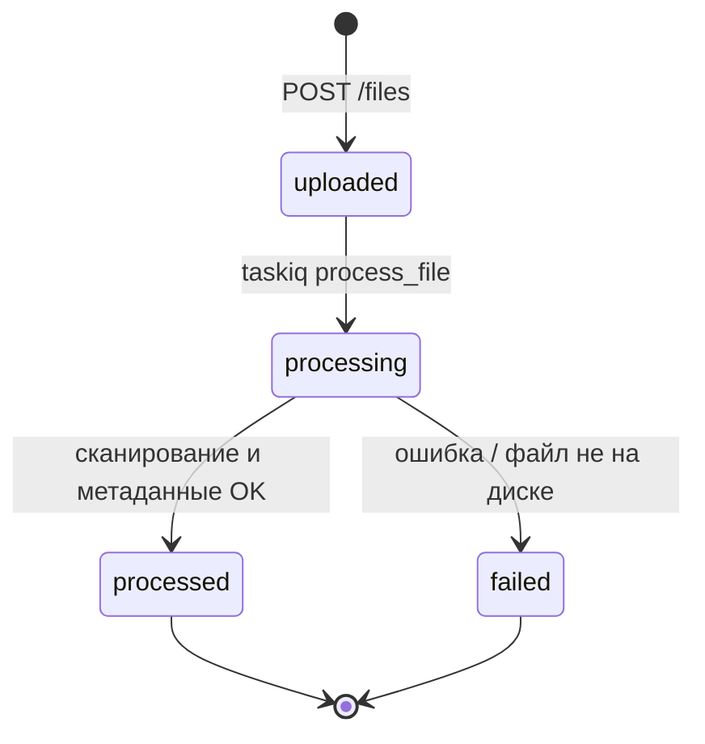

# File Exchange — руководство разработчика

Полное описание архитектуры, структуры кода, потоков данных и рабочих процессов. Для быстрого старта см. [README.md](../README.md).

---

## Содержание

1. [О проекте](#1-о-проекте)
2. [Стек](#2-стек)
3. [Инфраструктура Docker](#3-инфраструктура-docker)
4. [Структура репозитория](#4-структура-репозитория)
5. [Серверная часть](#5-серверная-часть)
6. [Модель данных](#6-модель-данных)
7. [Потоки данных](#7-потоки-данных)
8. [Конвейер обработки](#8-конвейер-обработки)
9. [Клиентская часть](#9-клиентская-часть)
10. [HTTP API](#10-http-api)
11. [Настройки и переменные окружения](#11-настройки-и-переменные-окружения)
12. [Разработка](#12-разработка)
13. [Тестирование и CI](#13-тестирование-и-ci)
14. [Точки расширения](#14-точки-расширения)
15. [Решение проблем](#15-решение-проблем)

---

## 1. О проекте

**File Exchange** — сервис обмена файлами для развёртывания на своей инфраструктуре: загрузка через веб-интерфейс, фоновое сканирование, извлечение метаданных и лента оповещений.

### Формат приложения

Модульный **асинхронный монолит**: один репозиторий, одно развёртывание, два процесса приложения (`backend` + `taskiq`), общие тома для файлов и одна PostgreSQL.

| Компонент | Роль |
| --------- | ---- |
| `backend` | HTTP API, запись файлов, постановка задач в очередь |
| `taskiq` | Фоновая обработка: сканирование → метаданные → оповещение |
| `frontend-dev` / `frontend` | интерфейс (Vite в dev / nginx в prod) |
| `nginx` | обратный прокси в prod |
| `postgres` | метаданные и оповещения (источник истины) |
| `redis` | брокер очереди Taskiq (не хранилище данных) |

### Ключевые доменные понятия

| Понятие | Описание |
| ------- | -------- |
| **StoredFile** | запись о файле: метаданные, статусы обработки и сканирования |
| **Alert** | оповещение по результату обработки (`info` / `warning` / `critical`) |
| **processing_status** | жизненный цикл: `uploaded` → `processing` → `processed` \| `failed` |
| **scan_status** | результат правил: `clean` \| `suspicious` \| `failed` |
| **metadata_json** | JSONB: расширение, размер, MIME; для текста — строки и символы; для PDF — страницы |

### Принципы кода

- Бизнес-логика — в **сервисах** и **чистых функциях** (`processing/rules`, `processing/metadata`).
- Маршруты FastAPI — тонкий слой: валидация входа, вызов сервиса, ответ Pydantic.
- Один `session_scope()` на HTTP-запрос и на задачу воркера.
- Постановка в очередь — **после фиксации транзакции** (`schedule_after_commit`), чтобы воркер не читал незакоммиченную запись.
- Конвейер обработки **идемпотентен**: повторный запуск не создаёт дубликат оповещения.

---

## 2. Стек

### Сервер (`backend/pyproject.toml`)

| Пакет | Назначение |
| ----- | ---------- |
| FastAPI 0.115 | HTTP API, OpenAPI |
| SQLAlchemy 2 + asyncpg | асинхронная ORM, PostgreSQL |
| Alembic | миграции схемы |
| Taskiq + taskiq-redis | фоновые задачи |
| structlog | структурированные логи (консоль / JSON) |
| filetype | сигнатура файла → расширение |
| pypdf | подсчёт страниц PDF |
| aiofiles | потоковая запись и чтение файлов |
| pydantic-settings | конфигурация из `.env` |

**Разработка:** pytest, pytest-asyncio, pytest-cov, ruff, mypy, httpx  
**Менеджер пакетов:** [uv](https://docs.astral.sh/uv/)

### Клиент (`frontend/package.json`)

| Пакет | Назначение |
| ----- | ---------- |
| Vue 3.5 + TypeScript | одностраничное приложение |
| Vite 6 | dev-сервер и сборка |
| Tailwind CSS 3 | стили |
| TanStack Vue Query 5 | запросы, кеш, опрос |
| vue-i18n 10 | RU / EN |
| vue-sonner | всплывающие уведомления |
| Vitest 3 | модульные тесты |

**Node:** 22+ (CI, Docker)

### Инфраструктура

PostgreSQL 16 · Redis 7 · nginx (alpine) · Docker Compose · mise

---

## 3. Инфраструктура Docker

Один файл `docker-compose.yml`. Профили **`dev`** и **`prod`** добавляют слой интерфейса; базовые сервисы (`backend`, `taskiq`, `postgres`, `redis`) стартуют всегда.

### Общая схема



### Сервисы

| Сервис | Профиль | Образ / сборка | Порты | Тома |
| ------ | ------- | -------------- | ----- | ---- |
| `backend` | всегда | `./backend` | `8000:8000` | `./backend:/app`, `file_storage:/data/files` |
| `taskiq` | всегда | тот же backend | — | `./backend:/app`, `file_storage:/data/files` |
| `postgres` | всегда | `postgres:16-alpine` | — | `pg_data` |
| `redis` | всегда | `redis:7-alpine` | — | — |
| `frontend-dev` | dev | `Dockerfile.dev` | `3000:3000` | `./frontend:/app`, анонимный `node_modules` |
| `frontend` | prod | `Dockerfile` | внутренний 80 | — |
| `nginx` | prod | `nginx:alpine` | `80:80` | `infra/nginx/nginx.conf` (только чтение) |

### Проверки состояния и зависимости

| Сервис | Проверка | Зависит от |
| ------ | -------- | ---------- |
| `postgres` | `pg_isready -U postgres -d fileexchange` | — |
| `redis` | `redis-cli ping` | — |
| `backend` | `curl http://127.0.0.1:8000/health` | postgres, redis (healthy) |
| `frontend-dev` | — | backend (healthy) |
| `frontend` | `wget --spider http://127.0.0.1/` | — |
| `nginx` | `wget --spider http://127.0.0.1/` | backend, frontend (healthy) |
| `taskiq` | — | postgres, redis (healthy) |

> Проверки используют `127.0.0.1`, не `localhost` — в Alpine `localhost` может резолвиться в IPv6 и давать отказ в соединении.

### Команды backend и taskiq

**backend:**

```text
uv run uvicorn src.main:app --host 0.0.0.0 --port 8000 ${UVICORN_RELOAD}
```

**taskiq:**

```text
uv run taskiq worker src.worker.broker:broker src.worker.tasks
```

### nginx (prod)

Файл `infra/nginx/nginx.conf`:

| Маршрут | Проксирует на | Назначение |
| ------- | ------------- | ---------- |
| `/api/` | `backend:8000` | HTTP API |
| `/health`, `/ready` | `backend:8000` | проверки состояния |
| `/` | `frontend:80` | статический интерфейс |

`client_max_body_size 50m` — должен совпадать с `MAX_UPLOAD_MB`.

### Тома

| Том | Содержимое |
| --- | ---------- |
| `pg_data` | данные PostgreSQL |
| `file_storage` | бинарные файлы (`STORAGE_PATH=/data/files`) |

---

## 4. Структура репозитория

```text
fullstack-test-task/
├── backend/
│   ├── src/
│   │   ├── main.py                 # приложение FastAPI, middleware, /health, /ready
│   │   ├── config.py               # настройки из .env
│   │   ├── logging_config.py       # structlog
│   │   ├── api/
│   │   │   ├── schemas.py          # FileItem, AlertItem
│   │   │   ├── middleware/         # db_session, request_id, http_logging
│   │   │   └── v1/                 # files, alerts
│   │   ├── services/               # files, processing, alerts
│   │   ├── processing/             # rules (сканирование), metadata
│   │   ├── storage/local.py        # диск: запись, read_header, защита путей
│   │   ├── worker/                 # broker, tasks
│   │   └── db/                     # models, session
│   ├── migrations/                 # Alembic
│   └── tests/
│       ├── unit/
│       └── integration/
├── frontend/
│   └── src/
│       ├── views/Dashboard.vue     # единственный экран
│       ├── composables/            # Query, confirm, i18n
│       ├── api/client.ts           # обёртка над fetch
│       ├── components/             # таблица, загрузка, оповещения…
│       └── i18n/locales/           # en.json, ru.json
├── infra/nginx/nginx.conf
├── docs/DEVELOPERS.md
├── docker-compose.yml
├── .mise.toml
├── .pre-commit-config.yaml
└── .github/workflows/ci.yml
```

---

## 5. Серверная часть

### Слои

| Слой | Модули | Ответственность |
| ---- | ------ | --------------- |
| HTTP | `api/v1/files`, `api/v1/alerts` | список, загрузка, скачивание, удаление, оповещения |
| HTTP | `api/middleware/*` | сессия БД, идентификатор запроса, логирование |
| Сервис | `services/files` | потоковая запись, запись в БД, постановка в очередь после commit |
| Сервис | `services/processing` | конвейер: сканирование → метаданные → статус → оповещение |
| Сервис | `services/alerts` | уровень и текст оповещения |
| Домен | `processing/rules` | чистые функции правил сканирования |
| Домен | `processing/metadata` | страницы PDF, статистика текста |
| Хранилище | `storage/local` | безопасные пути, поблочный ввод-вывод |
| Фон | `worker/tasks` | задача Taskiq `process_file` |
| Данные | `db/models`, `db/session` | ORM, асинхронная сессия |

### Middleware (порядок выполнения запроса)

Starlette вызывает middleware **в обратном порядке регистрации** (последний зарегистрированный — первый на входе):

```text
1. CORSMiddleware          allow_origins=["http://localhost:3000"]
2. db_session_middleware     session_scope() на весь запрос
3. request_id_middleware     X-Request-ID → structlog + заголовок ответа
4. http_logging_middleware   лог начала/завершения (пропуск /health, /ready)
5. обработчик маршрута
```

### Жизненный цикл сессии БД

```python
@asynccontextmanager
async def session_scope():
    session = session_factory()
    _session_ctx.set(session)
    session.info["after_commit"] = []
    try:
        yield session
        await session.commit()
        for hook in session.info["after_commit"]:
            await hook()          # ← здесь постановка задачи в Redis
    except Exception:
        await session.rollback()
        raise
    finally:
        await session.close()
```

- `get_session()` — доступ к текущей сессии через `ContextVar`; вне scope → `RuntimeError`.
- В тестах (`TESTING=true`) — `NullPool`; в prod — `pool_pre_ping=True`.
- HTTP: один scope на запрос (middleware).
- Воркер: отдельный scope в `process_file`.

### schedule_after_commit

```python
# services/files.py — после flush, до return
schedule_after_commit(lambda: _enqueue_process_file(file_id))
```

Гарантия: задача в Redis ставится только когда транзакция с `StoredFile` уже зафиксирована. Иначе воркер мог бы не найти запись.

### Taskiq

```python
# worker/broker.py
broker = ListQueueBroker(url=settings.redis_url)

# worker/tasks.py
@broker.task
async def process_file(file_id: str) -> None:
    async with session_scope():
        status = await run_pipeline(file_id)
```

- Брокер: очередь Redis (`taskiq-redis`).
- Воркер — отдельный контейнер, тот же образ, что у backend.
- Логи: `task.started`, `task.completed`, `task.failed`, `task.skipped` (файл не найден).

### Хранилище файлов

| Константа | Значение | Назначение |
| --------- | -------- | ---------- |
| `CHUNK_SIZE` | 256 KiB | потоковая запись и чтение |
| `HEADER_SIZE` | 8192 | начало файла для filetype |

- `resolve_path(root, stored_name)` — защита от обхода каталогов (`is_relative_to`).
- `save_stream(upload, dest, max_bytes)` — при превышении лимита удаляет частичный файл.
- Имя на диске: `{uuid}{suffix}`; в БД — `stored_name` (unique).

---

## 6. Модель данных

### ER-диаграмма



### Таблица `files`

| Колонка | Тип | Примечание |
| ------- | --- | ---------- |
| `id` | VARCHAR(36) PK | UUID строкой |
| `title` | VARCHAR(255) | имя в интерфейсе; автогенерация если пусто |
| `original_name` | VARCHAR(255) | имя из multipart |
| `stored_name` | VARCHAR(255) UNIQUE | `{id}{suffix}` на диске |
| `mime_type` | VARCHAR(255) | Content-Type или определение по расширению |
| `size` | INTEGER | байты |
| `processing_status` | VARCHAR(50) | `uploaded`, `processing`, `processed`, `failed` |
| `scan_status` | VARCHAR(50) NULL | `clean`, `suspicious`, `failed` |
| `scan_details` | VARCHAR(500) NULL | текст для интерфейса / i18n |
| `metadata_json` | JSONB NULL | извлечённые метаданные |
| `requires_attention` | BOOLEAN | флаг «подозрительный» |
| `created_at`, `updated_at` | TIMESTAMPTZ | UTC, значение по умолчанию на сервере |

**Индексы** (миграция `a1b2c3d4e5f6`): `ix_files_created_at DESC`.

### Таблица `alerts`

| Колонка | Тип | Примечание |
| ------- | --- | ---------- |
| `id` | SERIAL PK | |
| `file_id` | VARCHAR(36) FK | `ON DELETE CASCADE` |
| `level` | VARCHAR(50) | `info`, `warning`, `critical` |
| `message` | VARCHAR(500) | текст на английском; интерфейс переводит через i18n |
| `created_at` | TIMESTAMPTZ | |

**Индексы:** `ix_alerts_file_id`, `ix_alerts_created_at DESC`.

### Миграции Alembic

| Ревизия | Файл | Изменения |
| ------- | ---- | --------- |
| `0d6439d2e79f` | `init.py` | таблицы `files`, `alerts`, unique на `stored_name` |
| `a1b2c3d4e5f6` | `add_cascade_and_indexes.py` | FK CASCADE, индексы по `created_at` |

```bash
mise run migrate
# или
docker compose --profile prod run --rm backend uv run alembic upgrade head
```

---

## 7. Потоки данных

### Загрузка и обработка



### Состояния processing_status



### Удаление файла

```text
DELETE /api/v1/files/{id}
  → удаление файла на диске (missing_ok)
  → DELETE StoredFile
  → CASCADE alerts
```

---

## 8. Конвейер обработки

Функция `run_pipeline(file_id)` в `services/processing.py`.

### Шаги

| # | Действие | При сбое |
| - | -------- | -------- |
| 1 | загрузить `StoredFile` по ID | return `None` (задача пропущена) |
| 2 | если `processing_status == "processed"` | return `"processed"` |
| 3 | если оповещение для file_id уже есть | return текущий status (идемпотентность) |
| 4 | `processing_status = "processing"`, flush | |
| 5 | проверить файл на диске | `failed` + critical alert |
| 6 | прочитать начало файла (8192 B), `run_scan()` | |
| 7 | записать scan_status, scan_details, requires_attention | |
| 8 | `extract_metadata()` | `failed` + critical alert |
| 9 | `processing_status = "processed"`, создать оповещение | return `"processed"` |

### Правила сканирования (`processing/rules.py`)

Правила — чистые функции `(ScanContext) -> str | None`. Срабатывают **все** подходящие; причины склеиваются через запятую.

| # | Функция | Условие | Пример сообщения (в коде) |
| - | ------- | ------- | ------------------------- |
| 1 | `suspicious_extension` | `.exe`, `.bat`, `.cmd`, `.sh`, `.js` | `suspicious extension .exe` |
| 2 | `oversized_file` | `size > SCAN_MAX_MB` (10 MB) | `file is larger than 10 MB` |
| 3 | `pdf_mime_mismatch` | расширение `.pdf`, mime не `application/pdf` и не `application/octet-stream` | `pdf extension does not match mime type` |
| 4 | `magic_bytes_mismatch` | filetype ≠ расширение имени | `file content looks like .zip, not .pdf` |

**Результат `run_scan`:**

| Условие | scan_status | requires_attention |
| ------- | ----------- | ------------------ |
| есть причины | `suspicious` | `true` |
| нет причин | `clean` | `false` |

### Метаданные (`processing/metadata.py`)

| MIME | Поля в metadata_json |
| ---- | -------------------- |
| любой | `extension`, `size_bytes`, `mime_type` |
| `text/*` | + `line_count`, `char_count` (потоково) |
| `application/pdf` | + `approx_page_count` (pypdf в пуле потоков) |

### Оповещения (`services/alerts.py`)

| Условие | level | message (в backend) |
| ------- | ----- | ----------------- |
| `processing_status == "failed"` | `critical` | `File processing failed` |
| `requires_attention == true` | `warning` | `File requires attention: {scan_details}` |
| иначе | `info` | `File processed successfully` |

Интерфейс переводит сообщения через `useAlertText` и ключи в `i18n/locales/*.json`.

---

## 9. Клиентская часть

### Маршрутизация

Один экран — `views/Dashboard.vue`. `App.vue` оборачивает Dashboard, `ConfirmDialog`, `Toaster`.

### Компоненты

| Компонент | Назначение |
| --------- | ---------- |
| `AppHeader` | заголовок, переключатель языка |
| `StatsCards` | счётчики файлов и оповещений |
| `FileTable` | таблица файлов со статусами |
| `FileRowActions` | скачать / удалить |
| `FileStatusBadge` | бейдж обработки и сканирования |
| `FileUploadZone` | загрузка перетаскиванием |
| `AppDrawer` | боковая панель загрузки |
| `AlertTimeline` | лента оповещений |
| `ConfirmDialog` | подтверждение удаления |

### Composables

| Composable | Назначение |
| ---------- | ---------- |
| `useDashboard` | запросы files/alerts (опрос 1 с); мутации загрузки и удаления |
| `useAlertText` | i18n для level, message, scan_details |
| `useApiErrorMessage` | i18n для ошибок API |
| `useConfirm` | подтверждение через Promise (provide/inject) |

### Клиент API

```typescript
const API_BASE = import.meta.env.VITE_API_URL || "/api/v1";
```

| Окружение | VITE_API_URL | Как запросы доходят до backend |
| --------- | ------------ | ------------------------------ |
| dev (Docker) | не задан → `/api/v1` | прокси Vite `/api` → `VITE_PROXY_TARGET` |
| dev (локально) | не задан | прокси → `http://localhost:8000` |
| prod | `/api/v1` (Dockerfile ARG) | nginx `/api/` → backend |

### Опрос данных

TanStack Query с `refetchInterval: 1000` для `["files"]` и `["alerts"]`. После загрузки или удаления — `invalidateQueries` обоих ключей.

WebSocket и SSE не используются — осознанно простой опрос раз в секунду.

### Локализация (i18n)

- локали: `en`, `ru` в `src/i18n/locales/`
- стартовая: `localStorage.locale` → иначе `navigator.language` (ru* → ru)
- переводятся: интерфейс, уровни оповещений, типовые scan_details, ошибки API

---

## 10. HTTP API

JSON REST. Бизнес-эндпоинты — `/api/v1/`. Служебные — `/health`, `/ready` в корне.

| Окружение | Базовый URL | Доступ к API |
| --------- | ----------- | ------------ |
| dev (Vite) | `http://localhost:3000` | прокси `/api` |
| dev (напрямую) | `http://localhost:8000` | без прокси |
| prod | `http://localhost` | nginx → backend |

OpenAPI: `/docs`, `/redoc` — если `DOCS_ENABLED=true`.

### Общие правила

- **Аутентификация:** нет.
- **Пагинация:** `limit` (1–100, по умолчанию 50), `offset` (≥ 0). Сортировка: `created_at DESC`.
- **Идентификатор запроса:** заголовок `X-Request-ID` (опционально на входе, всегда на выходе).
- **Ошибки:** `{"detail": "…"}` или массив ошибок валидации (422).

### Служебные

#### `GET /health`

Живость процесса, без БД. **200:** `{"status": "ok"}`.

#### `GET /ready`

Проверка PostgreSQL. **200:** `{"status": "ready", "database": "ok"}`. **503:** БД недоступна.

### Файлы — `/api/v1/files`

#### FileItem

| Поле | Тип | Описание |
| ---- | --- | -------- |
| `id` | string | UUID |
| `title` | string | имя в интерфейсе |
| `original_name` | string | имя из загрузки |
| `mime_type` | string | |
| `size` | int | байты |
| `processing_status` | string | `uploaded` → `processing` → `processed` \| `failed` |
| `scan_status` | string \| null | `clean`, `suspicious`, `failed` |
| `scan_details` | string \| null | |
| `metadata_json` | object \| null | |
| `requires_attention` | bool | |
| `created_at`, `updated_at` | datetime | ISO 8601 UTC |

#### Эндпоинты

| Метод | Путь | Ответ | Ошибки |
| ----- | ---- | ----- | ------ |
| GET | `/api/v1/files` | `FileItem[]` | 422 (limit/offset) |
| GET | `/api/v1/files/{id}` | `FileItem` | 404 |
| POST | `/api/v1/files` | 201 `FileItem` | 400, 413, 422 |
| DELETE | `/api/v1/files/{id}` | 204 | 404 |
| GET | `/api/v1/files/{id}/download` | поток байтов | 404 |

**Тело POST:** `multipart/form-data`

| Поле | Обязательно |
| ---- | ----------- |
| `file` | да |
| `title` | нет (пустой → автогенерация) |

### Оповещения — `/api/v1/alerts`

Создаются только воркером. POST и DELETE нет.

#### AlertItem

| Поле | Тип |
| ---- | --- |
| `id` | int |
| `file_id` | string |
| `level` | `info` \| `warning` \| `critical` |
| `message` | string |
| `created_at` | datetime |

| Метод | Путь | Ответ |
| ----- | ---- | ----- |
| GET | `/api/v1/alerts` | `AlertItem[]` |

### Примеры curl

```bash
# загрузка
curl -X POST http://localhost:8000/api/v1/files \
  -F "file=@report.pdf" -F "title=Отчёт Q3"

# список
curl "http://localhost:8000/api/v1/files?limit=20&offset=0"

# скачивание
curl -OJ "http://localhost:8000/api/v1/files/{id}/download"

# оповещения
curl "http://localhost:8000/api/v1/alerts?limit=20"

# готовность (prod)
curl http://localhost/ready
```

---

## 11. Настройки и переменные окружения

Шаблон: [`.env.dev`](../.env.dev). Копировать в `.env` перед запуском.

| Переменная | По умолчанию | Назначение |
| ---------- | ------------ | ---------- |
| `POSTGRES_USER/PASSWORD/DB` | postgres / postgres / fileexchange | PostgreSQL |
| `DATABASE_URL` | `postgresql+asyncpg://…@postgres:5432/fileexchange` | SQLAlchemy async |
| `REDIS_URL` | `redis://redis:6379/0` | брокер Taskiq |
| `STORAGE_PATH` | `/data/files` | каталог файлов (том) |
| `MAX_UPLOAD_MB` | 50 | лимит загрузки (backend + nginx) |
| `SCAN_MAX_MB` | 10 | порог «подозрительно большой» при сканировании |
| `LOG_LEVEL` | INFO | structlog |
| `LOG_FORMAT` | console | `console` (dev) / `json` (prod) |
| `DOCS_ENABLED` | true | OpenAPI `/docs` |
| `UVICORN_RELOAD` | `--reload` | пусто в prod |

### Рекомендации для prod

```bash
LOG_FORMAT=json
DOCS_ENABLED=false
UVICORN_RELOAD=
```

---

## 12. Разработка

Этот раздел — практическое руководство: как поднять окружение, какие команды за что отвечают и как вносить типичные изменения в код.

### С чего начать

```bash
mise install          # Python 3.12 и uv (см. .mise.toml)
cp .env.dev .env      # переменные для Docker и локальных инструментов
mise run dev          # основной сценарий для ежедневной работы
```

**mise** — менеджер версий инструментов и обёртка над командами проекта. Вместо запоминания длинных цепочек (`docker compose …`, `uv run …`) в репозитории описаны именованные задачи в [`.mise.toml`](../.mise.toml). Файл `.env` mise подхватывает автоматически.

Типичный цикл разработки:

1. `mise run dev` — поднять стек (интерфейс на :3000, API на :8000).
2. Править код в `backend/src` или `frontend/src` — hot reload уже включён.
3. Перед коммитом сработают pre-commit-хуки (или вручную `mise run lint`).
4. `mise run test` — прогнать то же, что делает CI, перед push.

---

### Задачи mise

| Задача | Команда | Когда использовать |
| ------ | ------- | -------------------- |
| `dev` | `mise run dev` | ежедневная разработка |
| `up` | `mise run up` | проверить prod-сборку локально |
| `down` | `mise run down` | остановить все контейнеры |
| `migrate` | `mise run migrate` | применить миграции БД |
| `lint` | `mise run lint` | проверки качества без полного test |
| `test` | `mise run test` | полный прогон перед push |

#### `mise run dev`

Порядок действий внутри задачи:

1. **`lint`** — синхронизация зависимостей backend и pre-commit по всем файлам.
2. **`pre-commit install`** — регистрация git-хуков (будут запускаться при `git commit`).
3. **`docker compose --profile dev up --build`** — сборка и запуск:
   - `postgres`, `redis`, `backend`, `taskiq` (базовые сервисы);
   - `frontend-dev` (Vite на порту 3000).

После старта: [http://localhost:3000](http://localhost:3000) — интерфейс, [http://localhost:8000/docs](http://localhost:8000/docs) — OpenAPI.

#### `mise run up`

Prod-подобный режим для проверки «как на сервере»:

1. `down` — останавливает dev и prod (чистый старт, без гонок контейнеров).
2. `up -d --build` с `LOG_FORMAT=json`, `DOCS_ENABLED=false`, без `--reload`.
3. Профиль **prod**: `frontend` (собранный SPA), `nginx` на порту 80.
4. Одноразовый контейнер backend: `alembic upgrade head` (через `docker compose run`, не `exec`).

Результат: [http://localhost](http://localhost) — один вход, API под `/api/v1/`.

#### `mise run down`

Останавливает контейнеры **обоих** профилей (`dev` и `prod`) и удаляет осиротевшие сервисы (`--remove-orphans`).

#### `mise run migrate`

Запускает одноразовый контейнер backend и выполняет:

```text
uv run alembic upgrade head
```

Нужно после первого старта, после pull с новыми миграциями или если API отвечает 500 из‑за отсутствующих таблиц.

#### `mise run lint`

1. `uv sync --directory backend --all-groups` — актуальные зависимости Python.
2. `pre-commit run --all-files` — ruff, mypy, unit-тесты backend, vue-tsc, vitest.

Быстрее, чем `test`: не собирает Docker-образы и не гоняет integration-тесты с покрытием.

#### `mise run test`

Полная локальная копия CI (задача `lint` + далее):

1. Сборка образов `backend` и prod-`frontend`.
2. `mypy` внутри контейнера backend.
3. Миграции + `pytest` с покрытием ≥ 85%.
4. `npm ci`, typecheck, vitest, production-сборка frontend.

Занимает несколько минут — имеет смысл перед push в main или когда меняли и backend, и frontend.

---

### Локальная работа без полного Docker

Иногда удобно запустить только backend или frontend на хосте, а postgres и redis оставить в Docker:

```bash
# зависимости один раз
uv sync --directory backend --all-groups
npm --prefix frontend ci

# инфраструктура (postgres + redis + при необходимости taskiq)
docker compose up postgres redis taskiq -d

# backend на хосте
uv run --directory backend uvicorn src.main:app --reload --host 0.0.0.0 --port 8000

# в другом терминале — frontend
npm --prefix frontend run dev
```

| Что | Где крутится | Порт |
| --- | ------------ | ---- |
| API | хост (`uvicorn`) | 8000 |
| интерфейс | хост (Vite) | 3000 |
| PostgreSQL, Redis, taskiq | Docker | — |

Vite проксирует `/api` на `http://localhost:8000` (см. `frontend/vite.config.ts`).

**Ограничения:** пути в `.env` должны быть согласованы (`DATABASE_URL` на `localhost`, если postgres проброшен наружу — в dev-compose порт не проброшен, backend в Docker ходит на `postgres:5432`). Для простоты чаще используют `mise run dev`, где всё уже согласовано.

---

### Pre-commit

[`.pre-commit-config.yaml`](../.pre-commit-config.yaml) — набор проверок, которые запускаются **перед каждым коммитом** (после `mise run dev` хуки установлены автоматически).

| Хук | Что делает | Когда срабатывает |
| --- | ---------- | ----------------- |
| ruff | линтер Python, часть проблем исправляет сама | изменения в `backend/` |
| ruff-format | форматирование Python | изменения в `backend/` |
| mypy | проверка типов backend | изменения в `backend/` |
| pytest unit | быстрые модульные тесты backend | изменения в `backend/` |
| vue-tsc | проверка типов TypeScript/Vue | изменения в `frontend/` |
| vitest (`test:hook`) | модульные тесты frontend (кеш в `node_modules`, чтобы не портить git) | изменения в `frontend/` |

Пропустить хуки можно только флагом `git commit --no-verify` — в обычной работе не нужно.

Если коммит упал на хуке: исправить код, снова `git add`, **новый** коммит (не amend, если hook уже менял файлы).

---

### Как добавить правило сканирования

Правила — чистые функции в [`backend/src/processing/rules.py`](../backend/src/processing/rules.py). Каждая получает `ScanContext` и возвращает **текст причины** или `None`, если правило не сработало.

**Шаг 1.** Написать функцию:

```python
def double_extension(ctx: ScanContext) -> str | None:
    if ctx.extension.count(".") > 1:
        return f"multiple extensions in filename{ctx.extension}"
    return None
```

**Шаг 2.** Добавить в список `RULES` (порядок = порядок проверки):

```python
RULES = [suspicious_extension, oversized_file, pdf_mime_mismatch, magic_bytes_mismatch, double_extension]
```

**Шаг 3.** Модульный тест в [`backend/tests/unit/test_rules.py`](../backend/tests/unit/test_rules.py):

```python
def test_double_extension() -> None:
    ctx = ScanContext(
        extension=".tar.gz",
        declared_mime="application/gzip",
        size=100,
        scan_max_bytes=SCAN_MAX,
    )
    status, details, attention, _ = run_scan(ctx)
    assert status == "suspicious"
    assert "multiple extensions" in details
    assert attention is True
```

**Шаг 4.** Перевод в интерфейсе (если сообщение показывается пользователю):

- строка из правила попадает в `scan_details` и в оповещение;
- [`frontend/src/composables/useAlertText.ts`](../frontend/src/composables/useAlertText.ts) сопоставляет английский текст с ключами i18n;
- добавить ключи в [`frontend/src/i18n/locales/ru.json`](../frontend/src/i18n/locales/ru.json) и `en.json`, при необходимости — regex в `translateScanDetail`.

Проверка: `uv run --directory backend pytest tests/unit/test_rules.py -q`, затем загрузить тестовый файл через UI или integration-тест.

---

### Как добавить фоновую задачу Taskiq

Фоновые задачи выполняются **вне HTTP-запроса**, в процессе `taskiq`. Сейчас есть одна задача — `process_file`; паттерн тот же для новых.

**Шаг 1.** Объявить задачу рядом с существующей или в новом модуле под `worker/`:

```python
# worker/tasks.py
@broker.task
async def rebuild_index(file_id: str) -> None:
    async with session_scope():
        ...  # бизнес-логика
```

**Шаг 2.** Убедиться, что модуль импортируется воркером. Команда в [`docker-compose.yml`](../docker-compose.yml):

```text
taskiq worker src.worker.broker:broker src.worker.tasks
```

Последний аргумент — модуль с задачами. Если задача в `worker/other_tasks.py`, добавить его в команду или импортировать задачи из `tasks.py`.

**Шаг 3.** Поставить задачу в очередь.

- **Сразу** (не зависит от транзакции БД):

  ```python
  await rebuild_index.kiq(file_id)
  ```

- **После успешного commit** (как при загрузке файла — запись в БД должна быть видна воркеру):

  ```python
  schedule_after_commit(lambda: rebuild_index.kiq(file_id))
  ```

  Вызов — из сервиса, пока открыт `session_scope()` (HTTP-запрос или другая задача).

**Шаг 4.** Перезапустить воркер после изменения кода: `docker compose restart taskiq` (или пересборка при `up --build`).

Задача должна быть **идемпотентной**: повторная доставка из Redis не должна ломать данные — см. логику `run_pipeline` (проверка существующего оповещения).

---

## 13. Тестирование и CI

### Тесты backend

| Каталог | Что проверяет |
| ------- | ------------- |
| `tests/unit/` | rules, metadata, session, storage, files |
| `tests/integration/` | HTTP API, ошибки, полный цикл загрузка → обработка |

Интеграционные тесты требуют Docker-стек (postgres, redis). В `conftest.py` — заглушка `process_file.kiq`, `TESTING=true`, NullPool.

### Frontend

Vitest + happy-dom. Покрытие ≥ 85% для `api/`, `composables/`, `utils/`, `i18n/index.ts`.

### GitHub Actions

| Job | Шаги |
| --- | ---- |
| `lint` | mise → pre-commit |
| `backend` | сборка → mypy → migrate → pytest 85% → артефакт coverage |
| `frontend` | npm ci → typecheck → vitest → build → артефакт |

Параллельные прогоны на одном ref отменяют предыдущий (cancel-in-progress).

### Локальный прогон

```bash
mise run test

# по отдельности
uv run --directory backend pytest tests/unit -q
uv run --directory backend pytest tests/integration -q
npm --prefix frontend run test
npm --prefix frontend run typecheck
```

---

## 14. Точки расширения

| Область | Как расширить |
| ------- | ------------- |
| правила сканирования | новая функция в `RULES` + тест + i18n |
| метаданные | ветка в `extract_metadata()` по mime |
| хранилище | заменить `storage/local.py` (S3 — новый модуль, тот же контракт) |
| оповещения | webhook или email после `create_alert_for_file` |
| интерфейс в реальном времени | SSE или WebSocket вместо опроса в `useDashboard` |
| аутентификация | middleware + dependency в маршрутах; воркер — отдельный service token |
| новые эндпоинты | роутер в `api/v1/`, сервис, схема, тест |

---

## 15. Решение проблем

| Симптом | Причина | Что сделать |
| ------- | ------- | ----------- |
| файл долго в `processing` | taskiq не работает | `docker compose ps` — healthy у taskiq, redis, postgres. Логи: `docker compose logs taskiq -f` |
| то же | исключение в воркере | трассировка в логах; `docker compose restart taskiq` |
| загрузка 413 | лимит размера | сверить `MAX_UPLOAD_MB` и nginx `client_max_body_size 50m` |
| интерфейс OK, API 500 | нет миграций | `mise run migrate`; `curl /ready` → `"database": "ok"` |
| API 404 | неверный путь | только `/api/v1/…` |
| nginx не стартует | порт 80 занят | освободить или `"8080:80"` в compose |
| Windows / странные пути | не-WSL shell | Docker Desktop + WSL2, команды из WSL |
